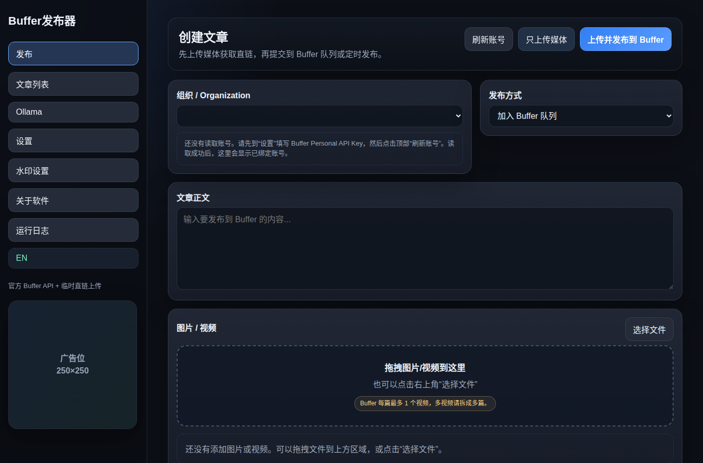
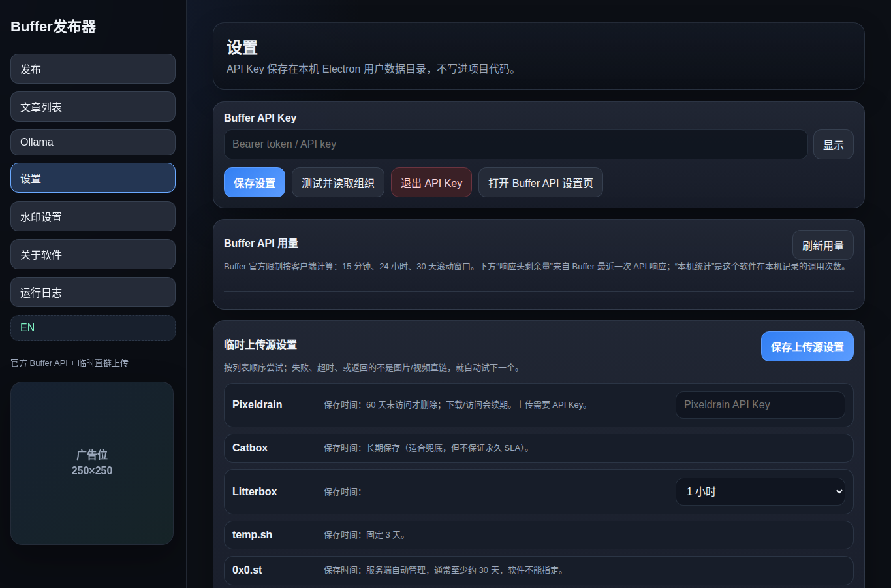
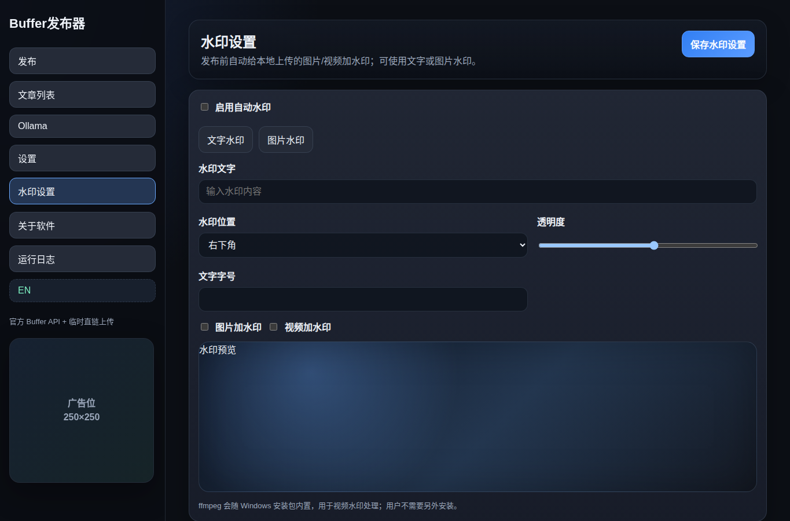
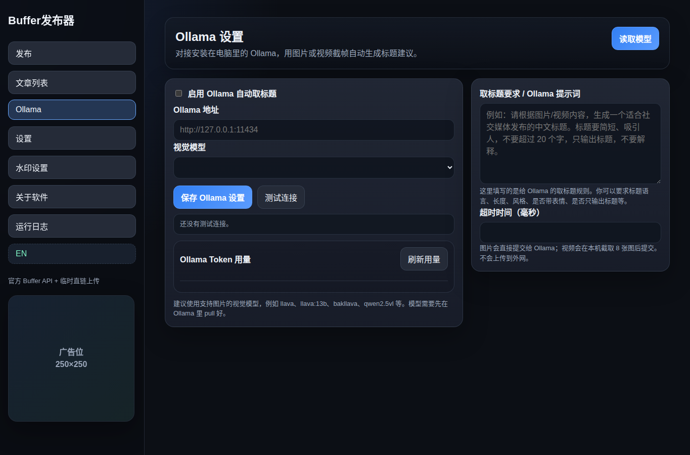
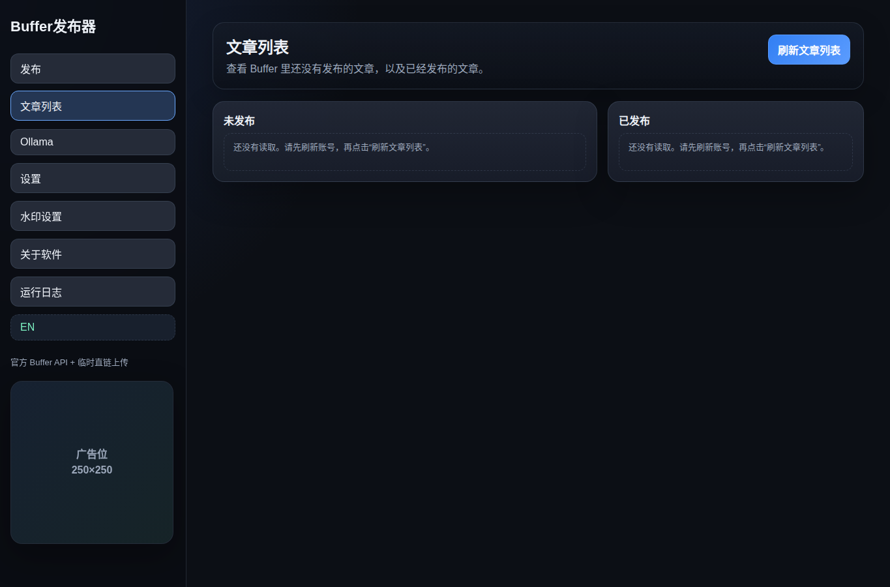

# Buffer发布器

Buffer发布器是一款桌面端社交媒体发布工具，用来把文字、图片和视频批量提交到 Buffer 队列，或按指定时间定时发布。软件基于 Electron 开发，支持 Windows 和 macOS。



## 主要功能

- **Buffer 官方 API 发布**：填写 Buffer Personal API Key 后读取组织、账号和频道。
- **多账号/多频道发布**：可一次选择多个 Buffer 频道，每个频道单独创建文章。
- **队列或定时发布**：支持加入 Buffer 队列，也支持选择本地时间定时发布。
- **图片/视频上传直链**：本地媒体会先上传到可公网访问的临时直链，再提交给 Buffer。
- **多上传源 fallback**：支持 Pixeldrain、Catbox、Litterbox、temp.sh、0x0.st、file.io，失败或超时会自动尝试下一个。
- **水印处理**：支持图片/视频发布前自动添加文字水印或图片水印。
- **Ollama 本机 AI 标题建议**：可使用本机 Ollama 视觉模型，根据图片或视频截帧生成标题建议。
- **文章列表查看**：可读取 Buffer 未发布和已发布文章列表。
- **API 用量统计**：显示 Buffer API 和 Ollama 的本机调用统计。
- **中英文界面**：可在中文和英文之间切换。

## 软件截图

### 创建文章


### 设置 Buffer API 和上传源



### 水印设置



### Ollama 标题建议



### 文章列表



## 使用方法

### 1. 下载并解压

在 GitHub Release 页面下载对应系统版本：

- Windows：下载 `Buffer发布器-windows-x64-版本号.zip`
- macOS Intel：下载 `Buffer发布器-mac-x64-版本号.zip`
- macOS Apple Silicon：如果 Release 中提供 `arm64` 包，M1/M2/M3/M4 Mac 优先下载该版本

解压后运行 `Buffer发布器`。

### 2. 获取 Buffer API Key

打开 Buffer API 设置页：

<https://publish.buffer.com/settings/api>

创建或复制 Personal API Key。

### 3. 配置软件

1. 打开软件左侧的 **设置**。
2. 在 Buffer API Key 输入框粘贴 API Key。
3. 点击 **测试并读取组织**。
4. 读取成功后，回到 **发布** 页面点击 **刷新账号**。
5. 选择要发布的组织和频道。

API Key 只保存在本机 Electron 用户数据目录，不会写入项目代码或 GitHub 仓库。

### 4. 发布文章

1. 在 **文章正文** 输入要发布的内容。
2. 拖入或选择图片/视频。
3. 选择发布方式：
   - **加入 Buffer 队列**：提交到 Buffer 队列。
   - **指定日期时间发布**：按选择的本地时间定时发布。
4. 点击 **上传并发布到 Buffer**。

如果只想先获取媒体直链，可以点击 **只上传媒体**。

## 重要说明

Buffer 官方 API 当前不直接接收本地文件上传。图片和视频必须先变成 Buffer 可以读取的公网直链，然后作为 assets 提交给 Buffer。

软件会验证上传源返回链接的 `Content-Type` 是否为 `image/*` 或 `video/*`，避免把普通网页链接提交给 Buffer。

Buffer 官方目前每篇文章最多支持 1 个视频。软件会在发布前拦截多视频，避免 Buffer 只保留第一个视频而静默丢失其他视频。

如果定时发布时间距离当前时间很久，临时直链可能在 Buffer 发布前失效。长时间定时发布建议优先使用 Pixeldrain 或 Catbox，并在 Buffer 队列里确认媒体已经显示成功。

## 水印功能

在 **水印设置** 页面可以开启自动水印：

- 支持文字水印和图片水印。
- 支持左上、右上、左下、右下、居中位置。
- 可调整透明度、文字字号、图片水印比例。
- 可分别控制图片和视频是否加水印。

视频水印依赖内置 ffmpeg，用户不需要单独安装。

## Ollama 标题建议

在 **Ollama** 页面可以配置本机 AI 标题建议：

- 默认地址：`http://127.0.0.1:11434`
- 需要先在电脑上安装并启动 Ollama。
- 需要安装支持视觉输入的模型，例如 `llava`、`bakllava`、`qwen2.5vl` 等。
- 图片会直接提交给本机 Ollama。
- 视频会在本机平均截取 8 张画面后提交给 Ollama。
- 生成结果只作为建议显示，不会自动覆盖正文；点击 **使用标题** 才会插入正文。

## 隐私和数据

- Buffer API Key、Pixeldrain API Key、水印设置、Ollama 设置等保存在本机用户数据目录。
- 项目源码中不包含用户 API Key。
- Ollama 标题建议在本机运行；图片/视频帧不会因为 Ollama 功能上传到外网。
- 发布到 Buffer 前，本地媒体会根据你的上传源设置上传到第三方临时文件服务，用于生成 Buffer 可读取的直链。

## 开发运行

由于 SMB/GVFS 共享盘不支持 npm 的部分 symlink/copyfile 行为，安装依赖时建议使用：

```bash
npm install --no-bin-links
```

运行：

```bash
npm start
```

语法检查：

```bash
npm run check
```

打包：

```bash
npm run dist:win
npm run dist:mac
```

> 注意：Windows 包通常可以在 Linux 上交叉打包；macOS 包在非 macOS 环境下可能只能生成部分 zip，具体以 electron-builder 输出为准。

## 技术栈

- Electron
- electron-builder
- Buffer API
- ffmpeg
- Ollama API

## License

Copyright © Cangify. All rights reserved.
